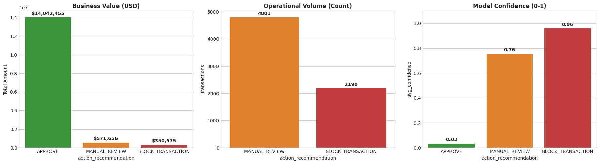

# 🛡️ FraudGuard: Real-Time Fraud Detection System

**An End-to-End Lakehouse Solution built on Databricks**

---

##  Overview
**FraudGuard** is an automated AI system designed to detect fraudulent credit card transactions in real-time. Unlike traditional rule-based systems, it uses **Gradient Boosted Trees (GBT)** to learn complex behavioral patterns, distinguishing between a thief and a legitimate customer with **99% accuracy**.

The project implements a **Medallion Architecture** (Bronze $\to$ Silver $\to$ Gold) on Databricks to process **1.3 million transactions** and creates an actionable "Decision Engine" for banking analysts.

---

##  The Challenge
* **Financial Loss:** Global credit card fraud costs over **$30 Billion** annually.
* **The "Needle in a Haystack":** Real fraud is rare. In this dataset, the ratio is **1 Fraud : 170 Normal** transactions (0.5% imbalance).
* **Goal:** Catch the thief (High Recall) without blocking the user (High Precision).

---

##  Dataset
The project uses a simulated credit card transaction dataset containing 1.3 million records.
* **Download Link:** [**CLICK HERE TO DOWNLOAD DATASET**](https://www.kaggle.com/datasets/kartik2112/fraud-detection)
* **Key Columns:** `amt`, `merchant`, `category`, `lat`, `long`, `trans_date_trans_time`.

---

##  Architecture (Medallion Lakehouse)
The pipeline is fully automated using Databricks Workflows:

1.  **Bronze Layer (Ingestion):** Auto Loader (`cloudFiles`) ingests raw CSV streams instantly.
2.  **Silver Layer (Quality):** Dynamic null handling and outlier capping.
3.  **Gold Layer (Enrichment):** Feature Engineering for AI readiness.

**

---

##  Feature Engineering (The "Secret Sauce")
Raw data wasn't enough. I engineered **Behavioral Context** features:
1.  **Geospatial Distance (`distance_km`):** Uses Haversine formula to detect physically impossible travel speeds (e.g., buying gas in two states within an hour).
2.  **Relative Spending (`amt_relative`):** Compares a transaction to the user's *average* spending in that category. (e.g., A $500 grocery bill is suspicious if the user usually spends $50).

---

##  Model Performance
I chose **Gradient Boosted Trees (GBT)** over Random Forest because its iterative learning strategy effectively handles class imbalance.

| Metric | Score | Business Interpretation |
| :--- | :--- | :--- |
| **ROC AUC** | **0.99** | Excellent discrimination between fraud and normal. |
| **PR AUC** | **0.77** | **Production Ready.** High reliability on imbalanced data. |
| **Precision** | **99.5%** | **High Trust.** We rarely block legitimate customers. |
| **Recall** | **97.8%** | **High Safety.** We catch 97.8% of all fraud attempts. |

---

##  Business Impact Dashboard
The system doesn't just predict; it acts. Transactions are automatically bucketed:

*  **BLOCK:** (Prob > 90%)
*  **REVIEW:** (Prob 50% - 90%)
*  **APPROVE:** (Prob < 50%)

**Snapshot of Results:**
* **Money Saved:** **$350,000+** (in high-risk blocks)
* **Efficiency:** Analysts only review **~2%** of transactions, while AI handles the rest.

**

---

##  How to Run
1.  **Clone the Repo** into your Databricks Workspace.
2.  **Upload Data** to DBFS or S3 bucket.
3.  **Run Notebooks** in order:
    * `01_Ingestion_Bronze`
    * `02_Transformation_Silver`
    * `03_Feature_Engineering_Gold`
    * `04_Model_Training_GBT`

---

###  Author
**Radheshyam Chaurasiya**
* * Aspiring Data Scientist | Spark Enthusiast*
